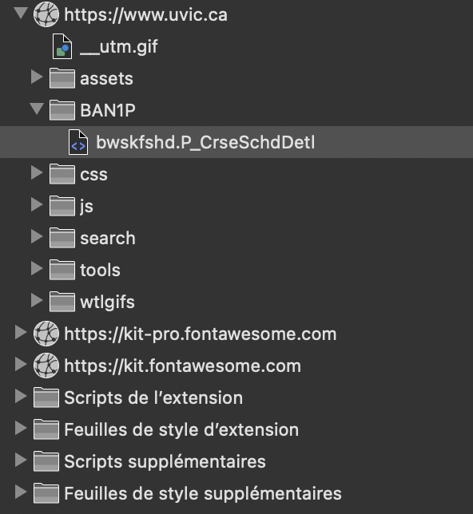

# README DUO

If you have Duo Authentication enabled, you can use the following to create your `.ics` file.

## Usage

You will need to login to [UVic](https://uvic.ca) with your NETLINK ID and PASSWORD. You will then be prompted to authenticate with Duo.

Once signed in, navigate to the following URL: [https://www.uvic.ca/tools/student/registration/detailed-timetable/index.php](https://www.uvic.ca/tools/student/registration/detailed-timetable/index.php)

Next you will be prompted to select a term. Select the term you want for the creation of your `.ics` file.

### Download the `.html` File

Open up the developer console in your browser while on the `detailed-timetable` page (the link we opened earlier). Select the `Sources` tab. The `BAN1P/bwskfshd.P_CrseSchdDetl` directory should be open by default. Select all the html code in the file and copy the code to your clipboard. 



**Note** You will need to do this for every term you want to create an `.ics` file for.

### Create the `.html` File

Next create a new file in the root directory of this git repository named `detailed-timetable.html`. Paste the code from your clipboard into the file. Save the file.

**Note** You will need to do this for every term you want to create an `.ics` file for.

### Create `.ics` File

```sh
python3 getScheduleAlternative.py -ics calendar-TERM.ics -html detailed-timetable.html
```

**Note** You will need to change the `-ics` and `-html` arguments to match your own file names. For example `-ics calendar-Summer.ics` and `-html timetable.html`. You will need to supply both the `-ics` and `-html` arguments unlike the non-duo authenetication method.

## Importing Calendar

The above command `python3 getScheduleAlternative.py -ics calendar-TERM.ics -html detailed-timetable.html` creates a file named `calendar-TERM.ics` located in the root directory of this git repository. You can import this file into your desired Calendar Application to import your UVic Schedule for that TERM. 

**Note** You will need to do this with every `.ics` file you create.  

Below is a list of links to resources if you need help, or want to read more about how to import an `.ics` file into your Calendar App.

* [Import to Google Calendar](https://support.google.com/calendar/answer/37118)
* [Import to Apple Calendar](https://support.apple.com/en-ca/guide/calendar/icl1023/mac)
* [Import to Outlook Calendar](https://support.microsoft.com/en-us/office/import-or-subscribe-to-a-calendar-in-outlook-on-the-web-503ffaf6-7b86-44fe-8dd6-8099d95f38df)

## `.ics` Format

```ics
BEGIN:VCALENDAR
VERSION:2.0
PRODID:-//UVic Schedule//UVic Schedule to Calendar Format Script//EN
X-WR-CALNAME:TERM Session: MONTH - MONTH YEAR
BEGIN:VEVENT
SUMMARY:COURSE XXX TYPE
DTSTART;TZID=America/Vancouver;VALUE=DATE-TIME:XXXXXXXXTXXXXXX
DTEND;TZID=America/Vancouver;VALUE=DATE-TIME:XXXXXXXXTXXXXXX
DTSTAMP;VALUE=DATE-TIME:XXXXXXXXTXXXXXXZ
UID:CRN-YEAR-MONTH@uvic.ca
RRULE:FREQ=FREQUENCY;UNTIL=XXXXXXXXTXXXXXX;INTERVAL=X;BYDAY=DAY
DESCRIPTION:Title: Course Title\nInstructor: FirstName LastName\nSection: XXX\nCRN: XXXXX\nRegistr
 ation Status: STATUS\nContact Information: EMAIL
LOCATION:LOCATION
END:VEVENT
END:VCALENDAR
```